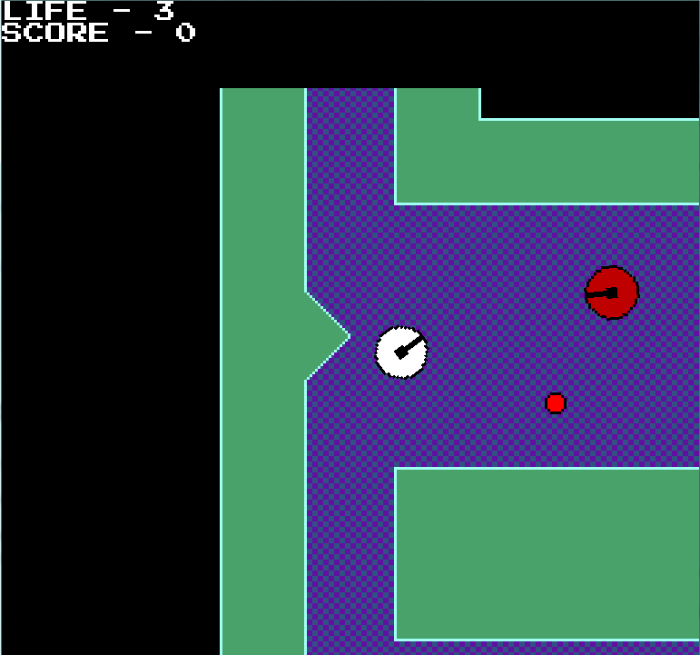

# Rebounds
This is my entry for [Game Off 2019](https://itch.io/jam/game-off-2019)

The theme for the jam is **Leaps & Bounds**.  

For my game, I decided on a top-down shooter. The gimmick is that your bullets can't hurt enemies normally.  
Instead, you need to rebound your bullets off of walls. If they make contact with an enemy after that point, then they take damage.  
Don't go trigger happy though; your rebounded bullets will hurt you too.

You can play the game either by going to the *Release* page, or through the browser [here](https://galbenshire.itch.io/rebounds).